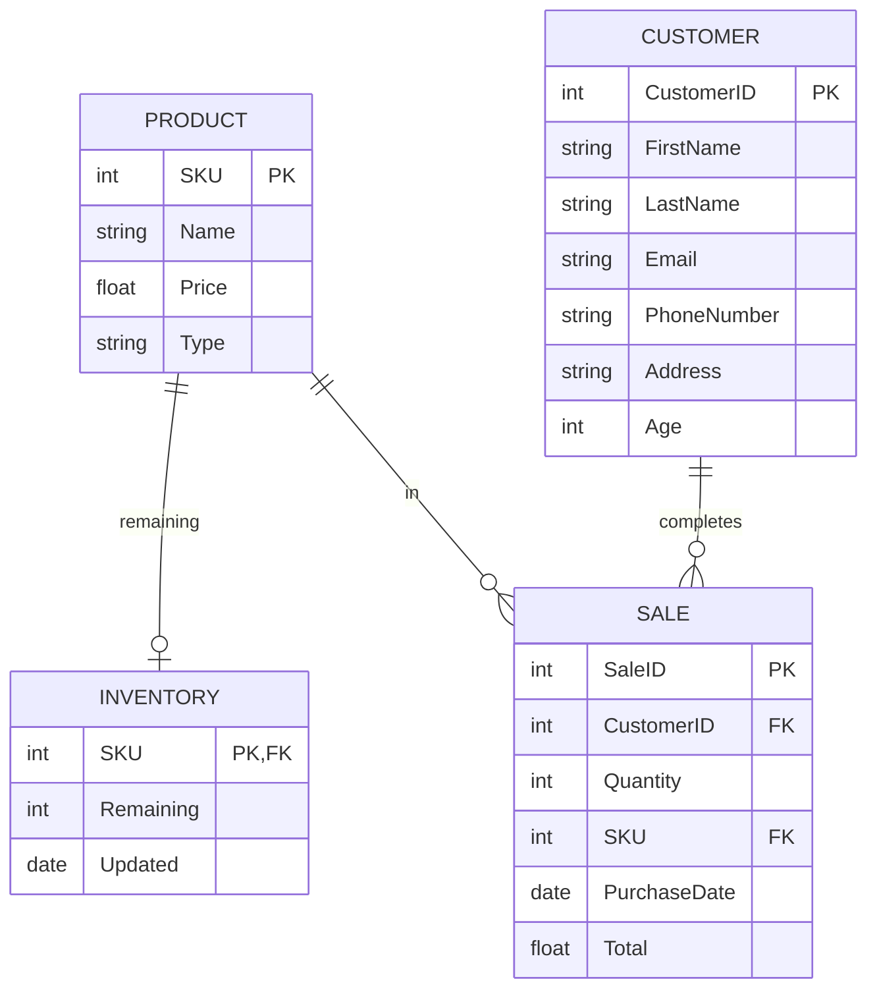

### Entity Descriptions
**_PRODUCT_**: Types of Nike shoes sold in the store. 

- Product attributes included: 
	- SKU - ID number assigned to keep track of the types of shoes.
	- Name - Name assigned to a specific model of shoe.
	- Price - The cost of the shoe. 
	- Type - The category that the shoe belongs in, such as soccer or running. 

**_CUSTOMER_**: Identifying information about the customer completing the purchase.

- Customer attributes included:
	- CustomerID - ID number assigned specifically to an individual. 
	- FirstName - The customer's first name.
	- LastName - The customer's last name. 
	- Email - The customer's email adress.
	- PhoneNumber - The customer's phone number. 
	- Address - Where the customer receives physical mail. 
	- Age - How old the customer is. 

**_SALE_**: Tracks the products that customers buy.

- Sale attributes included:
	- SaleID - Number assigned to a  whole purchase so that it can be looked up later if needed. 
	- CustomerID - ID number assigned specifically to an individual. 
	- Quantity - How many items a customer bought in one purchase. 
	- SKU - ID number assigned to keep track of the types of shoes.
	- PurchaseDate - The date that the customer completed the transaction. 
	- Total - How much the customer spent on their total purchase. 

**_INVENTORY_**: Keeps track of the amount of shoes left for each type. 

- Inventory attributes included: 
	- SKU - ID number assigned to keep track of the types of shoes.
	- Remaining - How many specific shoe types are left in stock and can be sold. 
	- Updated - The date that the inventory was last updated. 

### Entity Relationships and Impacts

**_PRODUCT_** in **_SALES_**:

Product is independent and exists without sale, while sale is dependent upon product to be created. This relationship helps the store see which products were included in a purchase and how often specific products are being bought. 

**_PRODUCT_** remaining **_INVENTORY_**:

Inventory assigns each product a number that represents the amount left in stock. This helps the business manage their stock. This relationship allows the store to see when they are running out of a specific product and to see which products have a high amount of inventory left. 

**_CUSTOMER_** completes **_SALE_**:

Customers can complete any number of sales and each sale will be linked to that individual. This allows the store to collect data such as: 
- Repeat customers
- Customers who purchase the most in quantity
- Customers who purchase the most financially
- How many items a customer purchases
- Dates that had the most sales 
